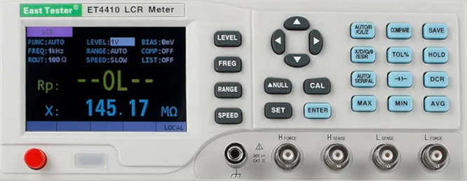

# ET44

Python class for remote controlling EastTester ET44 and ET45 series lcr meters:
ET4401, ET4402, ET4410, ET4501, ET4502, ET4510.

Should also work with RuoShui 4090A, 4090B, 4090C, 4091A, 4091B and 4091C branded 
devices. 



Sending raw SCPI commands to a device is cumbersome, so this class wraps all
that into a more approachable interface.

# In a Nutshell

Here is a little example script that illustrates how things work:

```{python}
#!/bin/env python3
from ET44 import ET44

# connect to the device
lcr = ET44("ASRL/dev/ttyACM0::INSTR")

# configure the device
lcr.setup(
    modeA="C", 
    modeB="Q", 
    freq=100, 
    volt=500, 
    bias=0,
    SerPar="SER", 
    speed="Slow"
    )

# take a measurement
C1, ESR1 = lcr.read()

# Change the frequency to 10kHz
lcr.freq = 10000

# measure again
C2, ESR2 = lcr.read()
```

# Status

[](https://github.com/nikku/works-on-my-machine)

This should work fine with all devices of the ET44/ET45 series as listed above.
However, I only have a ET4410 and no way of testing this on the other devices.

I have seen differently branded devices that look pretty much identical – e.g.
*Mustool*. If they really are just rebranded, they should also work.  However,
they probably return a different identity string preventing them to be
recognized. So if you have one of those, please get in touch.


| Feature                       | Status |
|-------------------------------|------- |
| Primary modes R,C,L,DCR,ECAP  |   ✓    |
| Secondary modes X,D,Q,THR,ESR |   ✓    |
| Ser/Par equivalent            |   ✓    |
| Read measurement values       |   ✓    |
| Signal voltage level          |   ✓    |
| Bias (DC offset)              |   ✓    |
| Measurement speed             |   ✓    |
| Relative mode                 |   ✓    |
| Trigger source                |   ✓    |
| Lock/unlock                   |   ✓    |
| Display options               |   ✓    |
| Output impedance              |   ✓    |
| min/max/avg                   |   –    |
| Comparator mode               |   –    |
| List scanning                 |   –    |
| Open/short calibration        |   –    |
| get/set range                 |  ???   |

Legend:

* `✓`: Implemented and working
* `–` : not implemented
* `???` : Not clear if this is possible / does not work as described in SCPI manual


# Installation

1. Download the latest release package (` et44-XXX.tar.gz `) from github.
2. If you want to install in a virtual environment, first, create and activate it:
```
python -m venv .venv
source .venv/bin/activate
```
3. Install the package (replace *XXX* with the correct number)
```
python -m pip install et44-XXX.tar.gz
```


# Reference

The following sections give a tour of available functionality.  Detailed
api-documentation is given in the doc-strings of the classes. Use `pydoc` to
access it:

    python -m pydoc ET44
    python -m pydoc ET44.instrument

For questions about valid values for all commands and general use of the
device, please refer to the manufacturers *user manual* and/or *scpi manual*.


## Connecting
    
This is how you connect to the device:

    from ET44 import ET44
    lcr = ET44("ASRL/dev/ttyACM0::INSTR")

Or, on windows:

    from ET44 import ET44
    lcr = ET44("ASRL2::INSTR")

Of course, you need to adapt it to the right device for your case.  See
[here](https://pyvisa.readthedocs.io/en/stable/introduction/names.html) for
details on pyvisa resource names.


## basic commands
    
Send a trigger event

    lcr.trig()

Get the identification data

    lcr.identify()

Print device and status information

    print(lcr)

Sound a beep

    lcr.beep()
    
Lock the keypad
    
    lcr.lock()

And unlock it again
    
    lcr.unlock()

You can also send raw SCPI commands to the device. There are two different
commands for that: `write` and `query`. The former will send a command and check
the status, the latter returns the data returned by the device:

    # set voltage level to 500mV:
    lcr.write("VOLT: 500")
    
    # query voltage level
    lcr.query("VOLT?")


## Configuring the device

In order to configure the device, you need to set the following parameters:

* *modeA*: primary parameter (R | C | L | Z | DCR | ECAP | AUTO)
* *modeB*: secondary parameter (X | D | Q | Θ | ESR)
* *SerPar*: equivalent model (SER | PAR)
* *signal voltage*
* DC *bias* (= DC offset)
* Measurement *speed*

You can set each of these parameters separately, or all at once (using the
`setup` method).

Categorical parameters are not case sensitive, so all of the following are
equivalent:

    lcr.speed = "fast"
    lcr.speed = "Fast"
    lcr.speed = "FAST"
    lcr.speed = "fAsT"


### Primary mode

The primary mode sets the type of component/parameter you want to measure. The
following modes are supported:

| Mode | Description                                                           |
|------|-----------------------------------------------------------------------|
| AUTO | Automatically detect type from connected component. Not recommended.  |
| R    | Resistance                                                            |
| C    | Capacitance                                                           |
| L    | Inductance                                                            |
| Z    | Impedance                                                             |
| DCR  | DC resistance                                                         |
| ECAP | Capacitance of electrolytic capacitors                                |

To get/set the primary mode, use the `modeA` method:

    # print current mode
    print(lcr.modeA)

    # set to resistance
    lcr.modeA = "R"

    # set to capacitance
    lcr.modeA = "C"

**Caution:** When set to `AUTO`, you cannot set `modeB` or `SerPar` – the
device will return an error when you try that. But that's not a big deal
because using `Auto` mode doesn't not make much sense in a remote control
scenario, to begin with.

`ECAP` is not really different from `C`, but it will also set defaults for
`volt` and `bias`. So don't be surprised that they change by setting `ECAP`
mode.


### Secondary mode

The secondary mode sets the secondary parameter you want to measure. The following
modes are supported:

| Mode  | Description                     |
|-------|---------------------------------|
| X     | Reactance                       |
| D     | Dissipation factor              |
| Q     | Quality factor                  |
| Theta | Phase angle Θ                   |
| ESR   | Equivalent series resistance    |

To get/set the secondary mode, use the `modeB` method:

    # print current mode
    print(lcr.modeB)

    # set to ESR
    lcr.modeA = "ESR"

    # set to phase angle
    lcr.modeA = "Theta"


### Series/parallel equivalent model

So get/set the series or parallel equivalent model for measurement use the
`SerPar` method:


    # print current mode
    print(lcr.SerPar)

    # set to series
    lcr.SerPar = "Ser"

    # set to parallel
    lcr.SerPar = "PAR"


### Voltage level and bias

You can set signal voltage in the range supported by your specific device.  The
ER44xx models support 6 discrete values (100, 300, 600, 1000, 1500, 2000mV),
while the ET45xx models will accept any integer value in the range [10, 2000]mV.

You can query the class for the supported range of the connected device:

    # show the voltage range supported by your device
    print(lcr.voltrange)

To get/set the voltage use the `volt` method:

    # print signal voltage
    print(lcr.volt)

    # set voltage to 1V
    lcr.volt = 1000

    # set voltage to 0.6V
    lcr.volt = 600

A DC bias (aka DC offset) in the range [0, 1500]mV can be added to the signal –
e.g. to ensure strictly positive voltage across the component during
measurement. Use the `bias` method to get/set the DC bias:

    # print bias
    print(lcr.bias)

    # set bias o 1V
    lcr.bias = 1000

    # set bias 0.5V
    lcr.volt = 500


### Frequency

Measurement frequency can be set in a range that depends on your specific model:

| Model          | Frequency Range [Hz]                               |
|----------------|----------------------------------------------------|
| ET4401 / 4090A  | 100, 120, 200, 400, 800, 1000, 2000, 4000, 8000, 10000  |
| ET4402 / 4090B  | 100, 120, 200, 400, 800, 1000, 2000, 4000, 8000, 10000, 15000, 20000
| ET4410 / 4090C  | 100, 120, 200, 400, 800, 1000, 2000, 4000, 8000, 10000, 15000, 20000, 40000, 50000, 80000, 100000 |
| ET4501 / 4091A  | 10 – 10000                                         |
| ET4502 / 4091B  | 10 – 20000                                         |
| ET4510 / 4091C  | 10 – 100000                                        |
         
You can  query the class for the supported range of the connected device:

    # show the frequency range supported by your device
    print(lcr.freqrange)

In order to get/set the measurement frequency, use the `freq` method:
   
    # print frequency
    print(lcr.freq)

    # set frequency to 10Hz
    lcr.freq = 100

    # set frequency to 10kHz
    lcr.freq = 10000

### Measurement Speed

To get/set the measurement speed, use the `speed` method. Valid modes are `FAST`,
`MEDIUM` and `Slow`:

    # print current mode
    print(lcr.speed)

    # set to slow
    lcr.speed = "slow"

    # set to fast
    lcr.speed = "Fast"

Speed is inversely correlated with accuracy. So unless you are in a hurry,
`slow` mode is recommended.


## Output impedance

These meters offer two different choices for oiutput impedance: 30Ω and 100G.
to get/set it use the `impedance` property:

    # print current output impedance
    print(lcr.impedance)

    # set outpout impedance to 100Ω
    lcr.impedance = 100


## Trigger source

Measurements can be triggered in three ways:

* automatically (`INT`)
* externally ("EXT") via the trigger input at the back
* manually ("MAN") by the `lcr.trig()` method

To get/set the source, use the `lcr.trigger` property:

    # print current trigger source
    print(lcr.trigger)

    # set trigger mode to manual
    lcr.trigger = "MAN"


### Relative (Δ null) mode

The manual calls this mode *Δ* or *null*, the SCPI manual calls it *dev* mode.
However, I think *relative mode* is more common so that's what I'm calling it.

By activating relative mode, the instrument will display/return relative
measurements with respect to the value measured at the time *rel* mode was
activated. To get/set rel mode, use the `rel` method:

    # print current mode
    print(lcr.rel)

    # set rel
    lcr.rel = "ON"

    # return to normal mode
    lcr.rel = "off"


### Quick setup

To set many measurement parameters at once, you can use the `setup method`. The
function accepts all of the setup parameters in single function call and you
can either provide them in the order `modeA, modeB, freq, voltage, bias,
SerPar, speed, trigger` or by name. In the latter case you can omit as many
parameters as you like – in that case they will remain unchanged.

E.g.
    
    # Capacitance and Quality factor at 100Hz using a 0.5V signal with no bias 
    # in series mode and fast measurement
    #
    #           ________________________________________ modeA
    #          |     ___________________________________ modeB
    #          |    |     ______________________________ freq
    #          |    |    |     _________________________ volt
    #          |    |    |    |    _____________________ bias
    #          |    |    |    |   |     ________________ SerPar
    #          |    |    |    |   |    |       _________ speed
    #          |    |    |    |   |    |      |        _ trigger source
    #          |    |    |    |   |    |      |       |
    lcr.setup("C", "Q", 100, 500, 0, "SER", "FAST", "INT")
    
    # the same using parameter names
    lcr.setup(
        modeA="C", 
        modeB="Q", 
        freq=100, 
        volt=500, 
        bias=0,
        SerPar="SER", 
        speed="FAST",
        trigger="INT",
        )
    
    # the same using parameters in a different order
    lcr.setup(
        trigger="INT",
        modeA="C", 
        modeB="Q", 
        SerPar="SER", 
        freq=100, 
        speed="FAST"
        volt=500, 
        bias=0,
        )

    # Now change voltage and bias
    lcr.setup(volt=1000, bias=500)

    # Now measure in slow mode
    lcr.setup(speed="slow")

The `setup` method does not include *rel* mode. This is on purpose, as you
probably want to configure the device first, then connect the DUT and allow the
measurement value to settle before activating *rel* mode. Sorry for the
inconvenience.


## Reading values

After setup, you can start reading measurement values from the device using the
`read` method. `read` is a function and returns a tuple of two floating point
values:

* Value of primary parameter (defined by `modeA`)
* Value of secondary parameter (defined by `modeB`)

Example:
   
    # Setup measurement
    lcr.modeA = "C"
    lcr.modeB = "esr"

    # get measurement
    C, ESR = lcr.read()


# Trouble shooting

All communication parameters were derived from the way my ET4410 behaves.  It
is quite possible that different models and/or firmware or hardware revisions
behave differently. If you encounter problems, you can try tweaking a few
parameters:

| parameter  | Description                                               |
|----------  |---------------------------------------------------------  |
| `baudrate` | must match baudrate set in device (default: 9600)         |
| `eol_r`    | line terminator for reading from device (default: "\r\n") |
| `eol_w`    | line terminator for writing to device (default: "\r\n")     |
| `delay`    | delay after read/write operation [s] (default: 0.0)       |
| `timeout`  | timeout [ms] before giving up on `read` requests (default: 2000) |


Example:

    lcr = EZ44("ASRL/dev/ttyACM0", delay=0.5, baudrate=14400)

If you have a rebranded device, it may not be recognized because the model
identification string is different. You can override automatic model detection by
setting the `model` argument in the constructor method. E.g.:

    lcr = EZ44("ASRL/dev/ttyACM0", model="ET4410")

This will assume the device is the specified model even if the model string
suggests otherwise.


You can also try talking to the device directly with a terminal program. E.g. `tio`:

    tio --input-mode line -e -b 9600 -m ONLCRNL /dev/ttyACM0


# Contributing

If you think you found a bug or you have an idea for a new feature, please open
an issue here on GitHub. Please **do not submit pull-requests before discussing
the issue** you want to address.

If you want to report a bug, please make sure to replicate the erroneous
behavior at least once before opening an issue and provide all information
necessary to replicate the problem (what commands did you use, what was
connected to the device, what did you observe, what did you expect?).

I would very much appreciate help from people who own any of the various models
listed above: It would be great if they could run the automated tests on their
devices and let me know if that went fine or produced errors. Please get in
touch if you would like to do that. Also any feedback and bug reports are
welcome.

