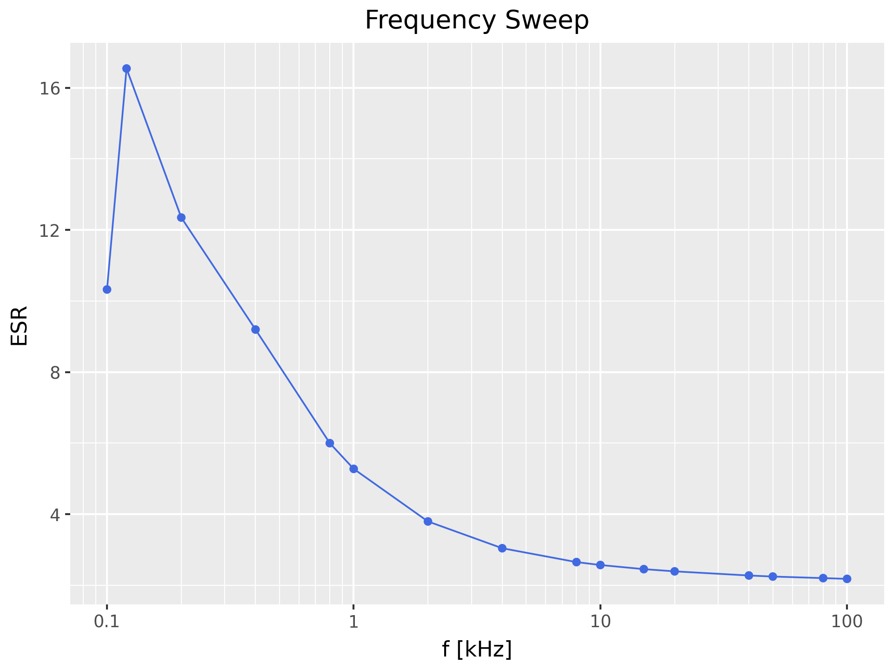

# Frequency Sweep

Little program that will perform a frequency sweep for a measurement – i.e.
take the same measurement at different frequencies.

The measurement results are saved in CSV format and as a plots.

You need to specify one major mode (L, C, R or Z). You can specify one or more
secondary modes (X, Q, D, Theta or ESR) if you like. All variables will be
plotted against measurement frequency, individually.

## Prerequisites

    # create a virtual environment
    python -m venv _venv

    # activate the virtual environment
    source _venv/bin/activate

    # install prerequisites
    python -m pip install -r requirements.txt

## Usage

To get usage help, use the  `-h` option:

    ❯ ./sweep.py -h
    usage: sweep [-h] [-i RID] [-s SERPAR] [-v VOLT] [-b BIAS] [-S SPEED] [-d DELAY]
                 [-o OUTPUT] [-D DPI] [-f FORMAT]
                 {L,C,R,Z} [{Q,X,Theta,D,ESR} ...]

    Frequency sweep measurement

    positional arguments:
      {L,C,R,Z}            Primary parameter
      {Q,X,Theta,D,ESR}    Secondary parameter(s) (default: None)

    options:
      -h, --help           show this help message and exit
      -i, --rid RID        VISA resource ID (default: ASRL/dev/ttyACM0::INSTR)
      -s, --SerPar SERPAR  Equivalent model mode (SER | PAR) (default: SER)
      -v, --volt VOLT      Voltage level [mV] for measurement (default: 1000)
      -b, --bias BIAS      DC voltage bias [mV] (0 – 1500) (default: 0)
      -S, --speed SPEED    Speed (FAST | MEDIUM | SLOW) (default: slow)
      -d, --delay DELAY    Delay [s] after changing settings (default: 2.0)
      -o, --output OUTPUT  basename of the output files (default: sweep)
      -D, --dpi DPI        Image resolution (default: 300)
      -f, --format FORMAT  Image format (default: png)

### Example

Let's measure a 10µF electrolytic capacitor at 1V and 0.5V DC bias:

    ./sweep.py --volt 1000 --bias 500 C ESR Theta

or shorter:

    ./sweep.py -v 1000 -b 500  C ESR Theta Q D

The resulting data file (`sweep.csv`) looks like this:

    f,C,ESR,Theta,Q,D
    0.1,1.01207e-05,17.6229,-83.6064,8.93456,0.111925
    0.12,1.00252e-05,16.3986,-82.924,7.95367,0.125728
    0.2,1.0399e-05,12.3025,-80.8677,6.2166,0.16086
    0.4,8.93719e-06,9.14566,-78.3921,4.86624,0.205497
    0.8,8.26084e-06,5.98211,-76.0492,4.02551,0.24843
    1.0,8.07161e-06,5.26352,-75.053,3.74625,0.266933
    2.0,7.54186e-06,3.7891,-70.2418,2.78398,0.359158
    4.0,7.06194e-06,3.03856,-61.6612,1.85436,0.53927
    8.0,6.5974e-06,2.65117,-48.6772,1.13736,0.879228
    10.0,6.44421e-06,2.56962,-43.8649,0.96144,1.04011
    15.0,6.14082e-06,2.45036,-35.1918,0.705209,1.41792
    20.0,5.88646e-06,2.38751,-29.5172,0.566201,1.76616
    40.0,5.20205e-06,2.27089,-18.614,0.33681,2.96925
    50.0,4.94377e-06,2.24202,-16.0231,0.287165,3.48232
    80.0,4.31523e-06,2.19702,-11.8463,0.209837,4.7656
    100.0,3.93406e-06,2.17629,-10.5277,0.18584,5.38036

And here are the plots:

To change the basename of the file use the `-o/--output` option:

    ./sweep.py -v 1000 -b 500  C ESR -o 10µF-cap

