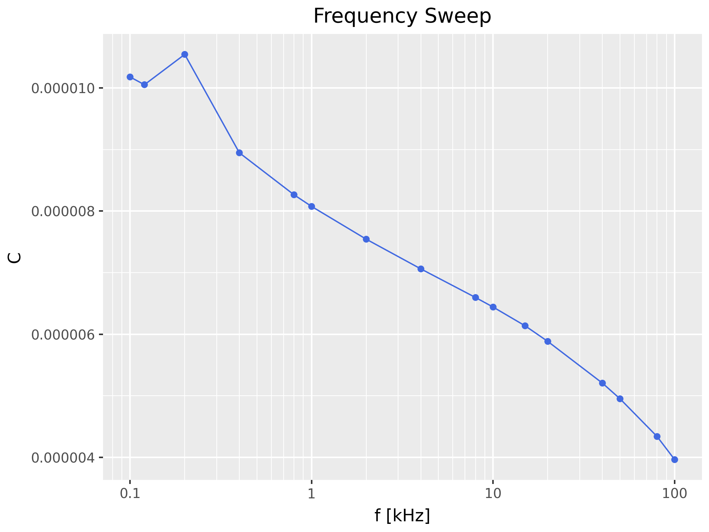

# Frequency Sweep

Little program that will perform a frequency sweep for a measurement – i.e.
take the same measurement at different frequencies.

The measurement results are saved in CSV format and as a plots.

You need to specify one major mode (L, C, R or Z). You can specify one or more
secondary modes (X, Q, D, Theta or ESR) if you like. All variables will be
plotted against measurement frequency, individually.

## Prerequisites

    # create a virtual environment
    python -m venv _venv

    # activate the virtual environment
    source _venv/bin/activate

    # install prerequisites
    python -m pip install -r requirements.txt

## Usage

To get usage help, use the  `-h` option:

    ❯ ./sweep.py -h
    usage: sweep [-h] [-i RID] [-s SERPAR] [-v VOLT] [-b BIAS] [-S SPEED] [-d DELAY]
                 [-o OUTPUT] [-D DPI] [-f FORMAT]
                 {L,C,R,Z} [{Q,X,Theta,D,ESR} ...]

    Frequency sweep measurement

    positional arguments:
      {L,C,R,Z}            Primary parameter
      {Q,X,Theta,D,ESR}    Secondary parameter(s) (default: None)

    options:
      -h, --help           show this help message and exit
      -i, --rid RID        VISA resource ID (default: ASRL/dev/ttyACM0::INSTR)
      -s, --SerPar SERPAR  Equivalent model mode (SER | PAR) (default: SER)
      -v, --volt VOLT      Voltage level [mV] for measurement (default: 1000)
      -b, --bias BIAS      DC voltage bias [mV] (0 – 1500) (default: 0)
      -S, --speed SPEED    Speed (FAST | MEDIUM | SLOW) (default: slow)
      -d, --delay DELAY    Delay [s] after changing settings (default: 2.0)
      -l, --log {x,y,xy,yx}
                           logarithmix axes (default: x)
      -o, --output OUTPUT  basename of the output files (default: sweep)
      -D, --dpi DPI        Image resolution (default: 300)
      -f, --format FORMAT  Image format (default: png)

### Example

Let's measure a 10µF electrolytic capacitor:

    ./sweep.py C ESR

or shorter:

    ./sweep.py C ESR

The resulting data file (`sweep.csv`) looks like this:

    f,C,ESR
    0.1,1.0096e-05,17.3074
    0.12,1.0001e-05,16.5064
    0.2,9.61154e-06,13.3734
    0.4,8.91973e-06,9.20879
    0.8,8.24562e-06,6.02199
    1.0,8.05891e-06,5.30232
    2.0,7.53342e-06,3.83347
    4.0,7.05841e-06,3.08616
    8.0,6.60163e-06,2.69975
    10.0,6.44973e-06,2.61833
    15.0,6.15661e-06,2.50292
    20.0,5.91693e-06,2.44038
    40.0,5.30923e-06,2.32259
    50.0,5.10358e-06,2.29291
    80.0,4.65435e-06,2.24624
    100.0,4.42856e-06,2.22718

And here are the plots:

Again, but his time with 500mV bias and a logarithmic x axis:
    
    ./sweep.py -b 500 -l x C ESR

